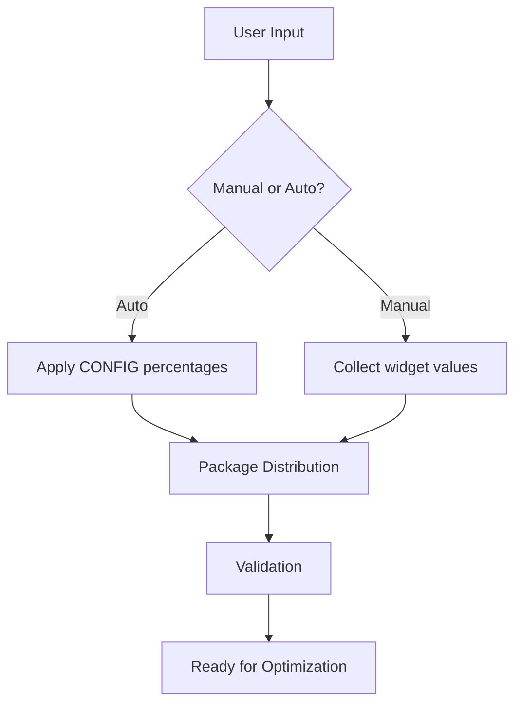
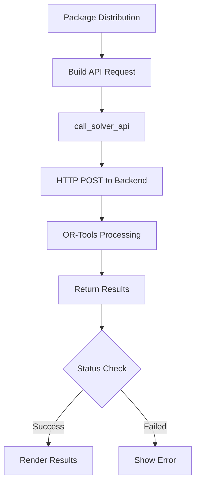
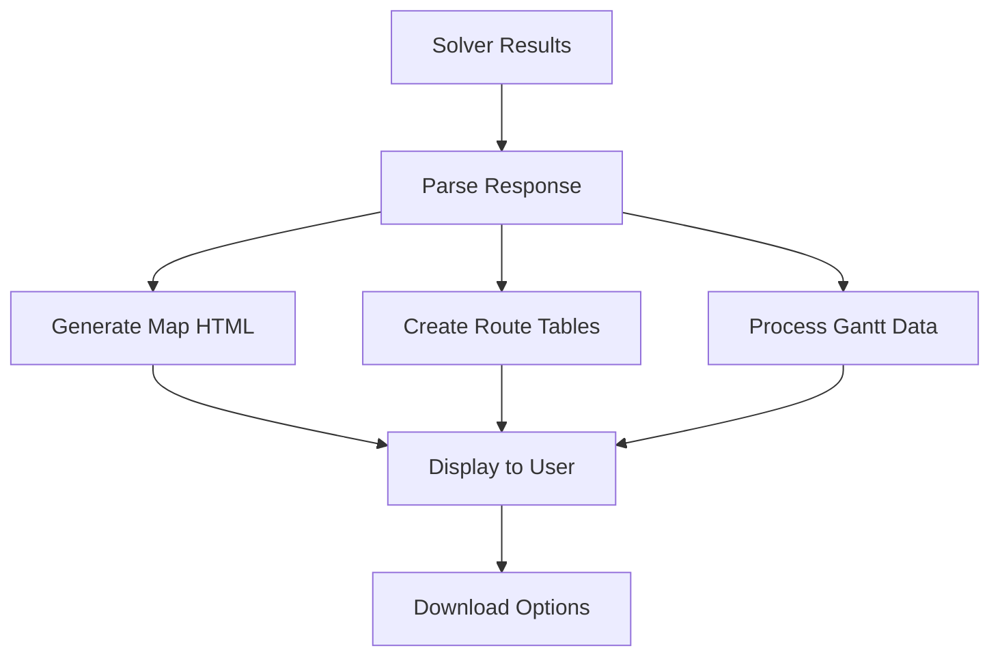

# PathMatrix Optimizer - System Architecture

> **Technical overview of system design, components, and data flow**

## 🏗️ System Overview

PathMatrix Optimizer follows a **client-server architecture** with clear separation between the user interface and the optimization engine.

```
┌─────────────────────┐    HTTPS     ┌─────────────────────┐
│   Frontend (UI)     │ ──────────► │   Backend (Solver)  │
│   Streamlit App     │             │   FastAPI + OR-Tools │
└─────────────────────┘             └─────────────────────┘
         │                                       │
         ▼                                       ▼
┌─────────────────────┐             ┌─────────────────────┐
│   User Browser      │             │   Cloud Platform    │
│   Interactive UI    │             │   (Render.com)      │
└─────────────────────┘             └─────────────────────┘
```

## 🧩 Component Architecture

### Frontend Components (Streamlit)

```
app.py
├── 🎛️  Configuration Management
│   ├── ConfigDict (Type-safe schema)
│   ├── Parameter validation
│   └── Default values
│
├── 🎨 User Interface Layer
│   ├── Input widgets (packages, cities)
│   ├── Result visualization (maps, charts)
│   ├── Download functions (Excel, HTML)
│   └── Error handling & feedback
│
├── 📊 Data Processing Layer
│   ├── Package distribution logic
│   ├── Map generation (Folium)
│   ├── Result formatting
│   └── State management
│
└── 🔌 API Communication
    ├── HTTP request handling
    ├── JSON serialization
    ├── Error recovery
    └── Response parsing
```

### Backend Components (External)

```
Solver API (FastAPI)
├── 🔍 Request Validation
├── 🧮 MIP Model Construction
├── ⚡ OR-Tools Optimization
├── 📈 Result Processing
└── 📤 Response Generation
```

## 🔄 Data Flow

### 1. User Input Processing



### 2. Optimization Flow



### 3. Result Visualization



## 🏛️ Design Patterns

### 1. **Type Safety First**
```python
# Strong typing throughout the system
class ConfigDict(TypedDict): ...
PackageDistribution = Dict[str, int]

def call_solver_api(input_data: Dict[str, Any]) -> Dict[str, Any]: ...
```

### 2. **Separation of Concerns**
- **UI Logic**: Streamlit widgets and layout
- **Business Logic**: Package distribution, validation
- **API Logic**: Communication with solver
- **Visualization**: Map and chart generation

### 3. **State Management**
```python
# Centralized state in Streamlit session
st.session_state = {
    "packages_per_destination": {...},
    "results": {...},
    "map_needs_update": bool
}
```

### 4. **Error Boundaries**
```python
# Comprehensive error handling at each layer
try:
    results = call_solver_api(data)
except requests.Timeout:
    return {"solver_status": "FAILED: Timeout"}
except Exception as e:
    return {"solver_status": f"FAILED: {str(e)}"}
```

## 🛠️ Technology Stack

### Frontend Stack
| Component | Technology | Purpose |
|-----------|------------|---------|
| **Framework** | Streamlit | Web UI framework |
| **Visualization** | Folium | Interactive maps |
| **Charts** | Plotly | Gantt charts, metrics |
| **Data Processing** | Pandas | Data manipulation |
| **HTTP Client** | Requests | API communication |

### Backend Stack (External Service)
| Component | Technology | Purpose |
|-----------|------------|---------|
| **API Framework** | FastAPI | REST API server |
| **Optimization** | Google OR-Tools | Mathematical solver |
| **Model Building** | Python | MIP formulation |
| **Hosting** | Render.com | Cloud deployment |

### Development Tools
| Tool | Purpose |
|------|---------|
| **Type Checking** | mypy, TypedDict |
| **Code Quality** | PEP 8, docstrings |
| **Version Control** | Git, GitHub |
| **Deployment** | Streamlit Cloud |

## 🚀 Deployment Architecture

### Production Environment

```
Internet
    │
    ▼
┌─────────────────────┐
│  Streamlit Cloud    │  ← Frontend hosting
│  (streamlit.app)    │
└─────────────────────┘
    │ HTTPS API calls
    ▼
┌─────────────────────┐
│   Render.com        │  ← Backend hosting
│   (FastAPI Server)  │
└─────────────────────┘
    │
    ▼
┌─────────────────────┐
│    OR-Tools         │  ← Optimization engine
│   (In-process)      │
└─────────────────────┘
```

### Development Environment

```
Local Machine
├── Frontend: streamlit run app.py (localhost:8501)
├── Backend: Points to production API
└── Development: Hot reload, debug mode
```

## 📁 File Structure

```
pathmatrix-optimizer/
├── app.py                     # 🎯 Main application
├── requirements.txt           # 📦 Dependencies
├── README.md                  # 📖 User documentation
├── docs/
│   ├── API_REFERENCE.md       # 🔧 API documentation
│   ├── FUNCTION_REFERENCE.md  # 📚 Auto-generated docs
│   └── ARCHITECTURE.md        # 🏗️ This document
├── assets/                    # 🎨 Static files (if any)
└── .streamlit/
    └── config.toml            # ⚙️ Streamlit configuration
```

## 🔒 Security Considerations

### API Security
- **Rate Limiting**: Backend implements request limits
- **Input Validation**: All user inputs validated before processing
- **Error Handling**: No sensitive information leaked in error messages
- **HTTPS Only**: All communication encrypted

### Data Privacy
- **No Persistence**: No user data stored permanently
- **Session Isolation**: Each user session independent
- **No Logging**: No personal data logged

## ⚡ Performance Characteristics

### Frontend Performance
- **Cold Start**: ~3-5 seconds (Streamlit Cloud)
- **Interaction Latency**: <500ms for UI updates
- **Map Rendering**: ~1-2 seconds for 11 cities
- **Memory Usage**: ~50-100MB per session

### Backend Performance
- **Optimization Time**: 5-30 seconds (typical scenarios)
- **Timeout Limit**: 120 seconds maximum
- **Throughput**: Handles multiple concurrent requests
- **Scalability**: Auto-scaling on Render.com

## 🔮 Extensibility Points

### Easy Extensions
1. **New Cities**: Add to `CITY_COORDINATES`
2. **Cost Models**: Modify `COST_PER_KM`, `MIN_COST_PER_TRIP`
3. **UI Components**: Add new Streamlit widgets
4. **Export Formats**: Add new download options

### Advanced Extensions
1. **Multiple Vehicle Types**: Extend ConfigDict
2. **Time Windows**: Enhance solver model
3. **Real-time Data**: Add external API integration
4. **Custom Maps**: Replace Folium with alternatives

## 🎯 Design Goals Achieved

✅ **Simplicity**: Clean, focused codebase  
✅ **Type Safety**: Full type annotations  
✅ **Scalability**: Stateless, cloud-ready architecture  
✅ **Maintainability**: Clear separation of concerns  
✅ **User Experience**: Fast, responsive interface  
✅ **Developer Experience**: Well-documented API  

---

*For detailed API usage, see [API_REFERENCE.md](API_REFERENCE.md)*  
*For complete function reference, see [FUNCTION_REFERENCE.md](FUNCTION_REFERENCE.md)*